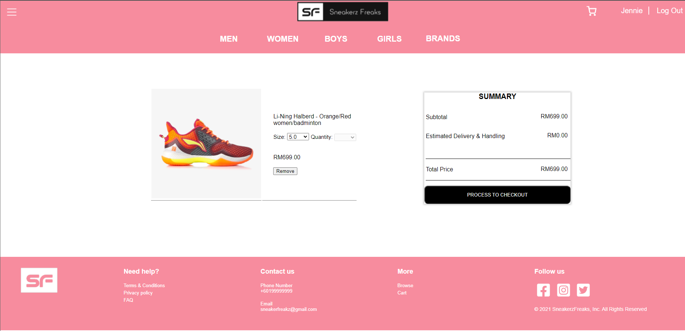

# OnlineShoesStore

## Overview

This is an online website selling new brands shoes called Sneakerz Freaks. This website is used to sell new brands shoes for adults, kids, men and women. This web application development includes the development of dynamic webpages using event-driven clients-sides scripts (HTML, CSS and Javascript). The website is storing its data in a MySQL database.

The website's layout is as shown in below: 
  

The website has THREE (3) types of user:
  
  1. Admin   
  Administrator has full permission to add, delete and edit data.
  2. Member  
  The member can view and buy the available shoes and the discounts.
  3. Guest  
  The guest does not need an account as they can only view the website data.
 

Besides, based on the user’s gender recorded in the database, the website style switches between a Womanish and Manish styles.

The main dashboard has a set of input elements for the user to filter the database data and see what they need. The shoes data (including picture) will be shown in a grid form within the main dashboard (just like Lazada’s view). When a user clicks on a shoe’s picture within the grid, its complete details of that shoes pair will be shown. Those details will appear in a new webpage that contains the following information / description of selection tabs:
  
- Details of shoe
- Size details
- Reviews
- Add to shopping lists
- Return policy and delivery information
 

The database contents can be filtered by shoe’s categories (Casual, Sport,…etc), footwear brands, gender and year of the product model. While they can be sorted by lower to higher prices; higher to lower prices, year of the product’s model and by discount.

The functions of the website are as follows:
1. Home
2. Login
3. Sign Up
4. Shop
5. Product Infomation
6. Shopping Cart
7. Blog
8. FAQ
9. About Us
10. Contact Us
11. Admin Dashboard
12. Admin Login
13. Product Management
14. FAQ Management
15. Contact Forms Management

## Tech Stack
1. HTML
2. CSS
3. JavaScript
4. PHP
5. MySQL

## Usage
Import the files into your project. 
Import the database.sql into MySQL database. 
Run the project with Wampserver or Xampp.

User Login information (can be retrieved in database): 
1. Username: john   Password: john
2. Username: jennie   Password: jennie

Admin Login Information(can be retrieved in database): 
Username: admin   Password: admin

## Test
Manual testing has been performed.

## Previews
1. Home     
2. Login     
3. Sign Up     
4. Shop     
5. Product Information     
6. Shopping Cart     
7. Blog List     
8. Blog Content     
9. FAQ     
10. About Us & Contact Us     
11. Admin Login     
12. Admin Dashboard     
13. Product Management     
14. FAQ Management     
15. Contact Forms Management     

## Contributors
1. Lean Wei Liang
2. Seow Kai Sheng
3. Tan Yuan Jie
4. Chan Liang Jye
5. Jeremy Lee Ye Cheng
